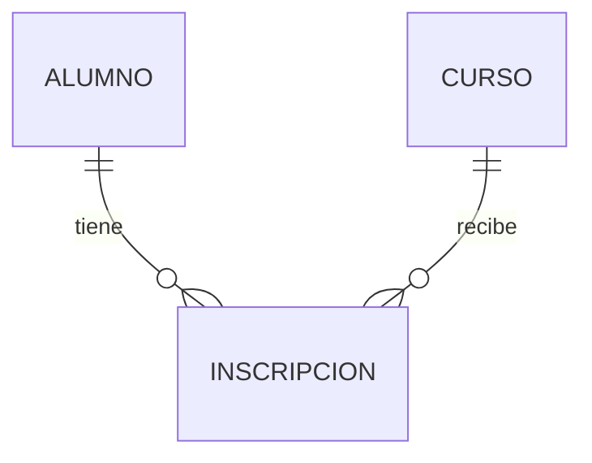

# Notación del esquema relacional

Hoy escribimos el esquema en texto, no en SQL. Usamos esta notación, la misma del viernes:

```
TABLA(**pk**, atributo, atributo_opcional?, fk → TABLA_REFERIDA)
```

| Símbolo | Significa |
|---|---|
| `**atributo**` (entre dobles asteriscos) | forma parte de la llave primaria |
| `→ TABLA` | llave foránea que referencia a la llave primaria de `TABLA` |
| `?` al final | admite `NULL` (si no lleva `?`, es obligatorio) |
| `UNIQUE` | no se puede repetir aunque no sea llave primaria |

## Ejemplo con el caso Control Escolar

```
CARRERA(**id_carrera**, nombre)
ALUMNO(**num_cuenta**, nombre, correo UNIQUE, id_carrera → CARRERA)
CURSO(**clave_curso**, nombre, creditos)
INSCRIPCION(**num_cuenta** → ALUMNO, **clave_curso** → CURSO, **semestre**, calificacion?)
```

Léanlo así:

- Cada alumno pertenece a una carrera y la carrera es obligatoria (no lleva `?`).
- `INSCRIPCION` resuelve la relación N:M entre `ALUMNO` y `CURSO`. Su llave primaria es compuesta e **incluye `semestre`** porque un alumno puede recursar el mismo curso en otro semestre. Si no incluyera `semestre`, el recursamiento sería imposible de registrar.
- `calificacion` admite `NULL` porque al inscribirse todavía no existe.

Esa última decisión —qué entra en la llave primaria de la tabla intermedia— es la que más se equivoca, y la que más les voy a preguntar.

## Diagrama (opcional)

Si quieren, además del texto pueden dibujar el esquema en Mermaid dentro del mismo archivo. GitHub lo renderiza solo:

````markdown

````

El texto es obligatorio; el diagrama no.
